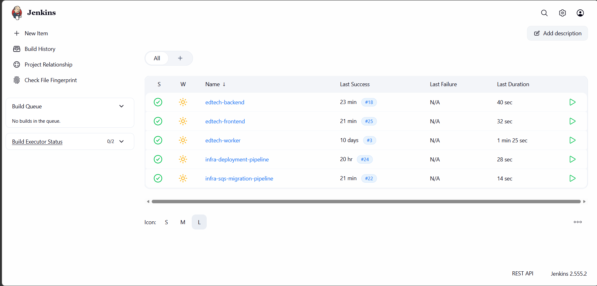
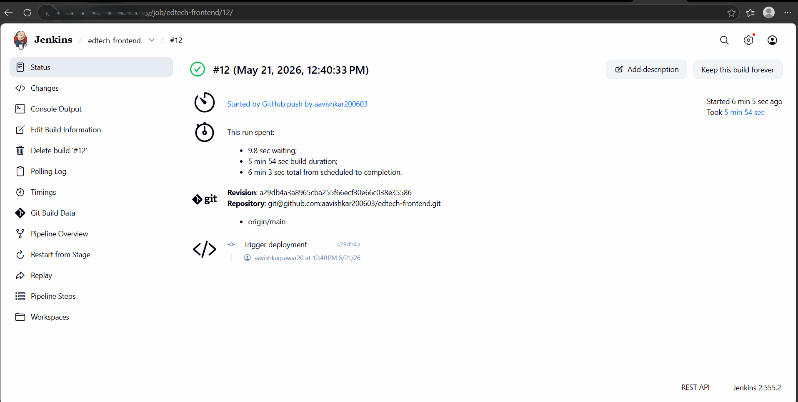
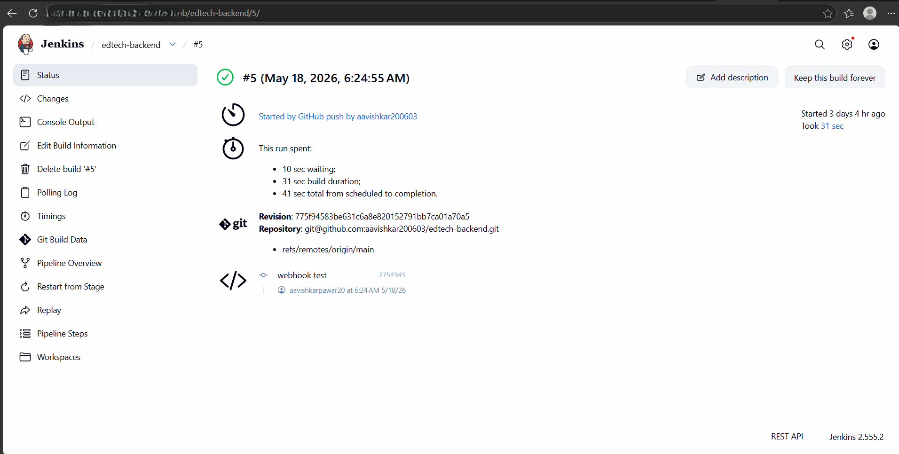
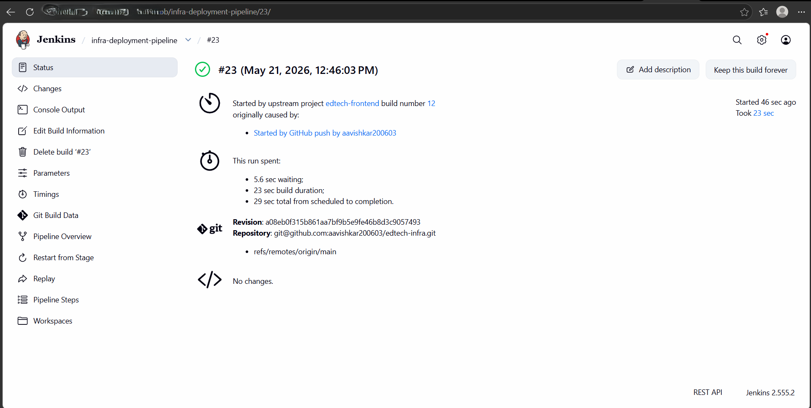
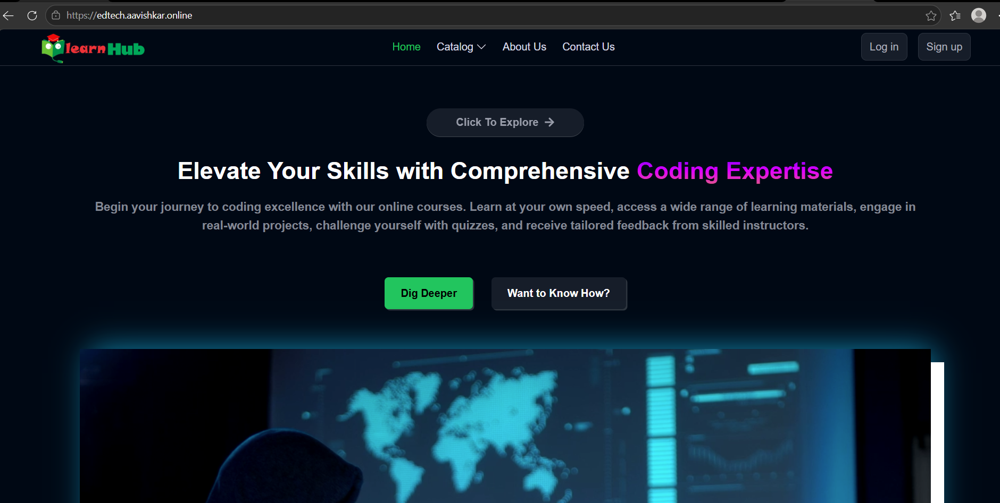
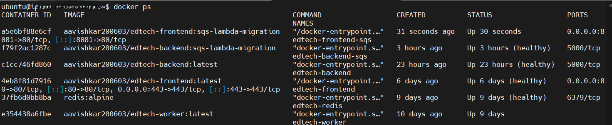

# Deployment Documentation

---

# CI/CD Overview

This project uses Jenkins-based multi-repository CI/CD pipelines integrated with Docker, DockerHub, and Ansible for automated deployment orchestration.

---

## Jenkins Pipeline Ecosystem

The platform uses multiple Jenkins pipelines for frontend, backend, worker, infrastructure deployment, and AWS-native migration workflows.

These pipelines automate:

- Docker image builds
- DockerHub image pushes
- Infrastructure deployment orchestration
- Branch-aware deployments
- AWS-native migration deployments



---

# Deployment Workflow


---

# Frontend CI/CD Pipeline

The frontend pipeline automates:

- Docker image build
- Build-time environment variable injection
- DockerHub image push
- Deployment pipeline trigger



---

# Backend CI/CD Pipeline

The backend pipeline automates:

- Backend Docker image build
- DockerHub image push
- Infrastructure deployment trigger



---

# Infrastructure Deployment Pipeline

The infrastructure deployment pipeline automates:

- Runtime secret generation
- Ansible deployment execution
- Latest image pull
- Container restart orchestration



# Monitoring and Alerting

CloudWatch alarms and Amazon SNS notifications were integrated to monitor asynchronous Lambda traffic and operational activity.

Implemented monitoring features include:

* Lambda invocation monitoring
* CloudWatch metric alarms
* Amazon SNS email notifications
* Event-processing visibility
* Traffic threshold alerting

These integrations demonstrate operational monitoring practices for cloud-native asynchronous systems.

---

# Ansible Responsibilities

Ansible automates:

- Deployment orchestration
- Runtime secret management
- Container updates
- Docker Compose deployment

---

# HTTPS Setup

Configured:

- Custom domain integration
- SSL certificate setup
- Nginx reverse proxy
- Elastic IP routing

## Live Deployment

- https://edtech.aavishkar.online



---

# Docker Runtime

The application runs using Docker Compose multi-container orchestration.

Containers:

- Frontend
- Backend
- Worker
- Redis



---

# Branch-Based Deployment Strategy

## Main Branch

Uses:

- BullMQ
- Redis
- Worker-based async processing

---

## sqs-lambda-migration Branch

Uses:

- Amazon SQS
- AWS Lambda
- Serverless event processing

---

# Environment Variables

## Example Configuration

```env
PORT=5000
MONGODB_URL=
JWT_SECRET=
AWS_REGION=
SQS_QUEUE_URL=
```

---

# Local Setup

## Clone Repository

```bash
git clone <repo-url>
cd <repo-name>
```

---

## Run Containers

```bash
docker compose up --build
```

---

# Access Application

## Frontend

```text
http://localhost
```

---

## Backend

```text
http://localhost:5000
```