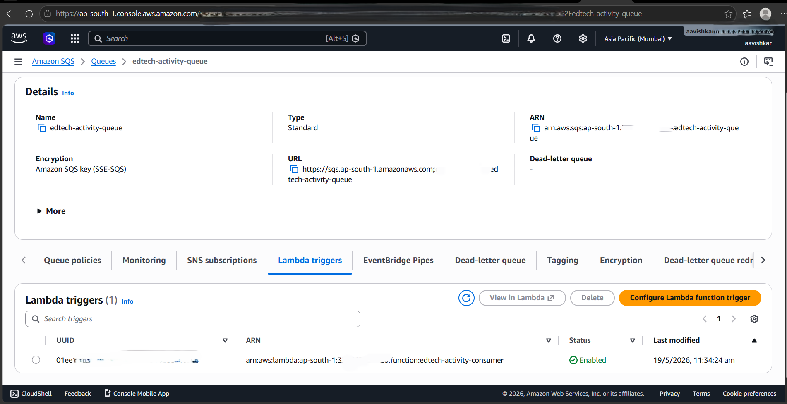
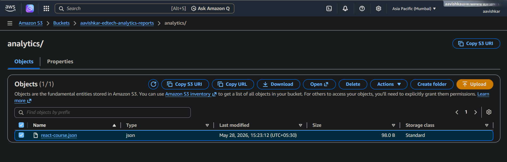
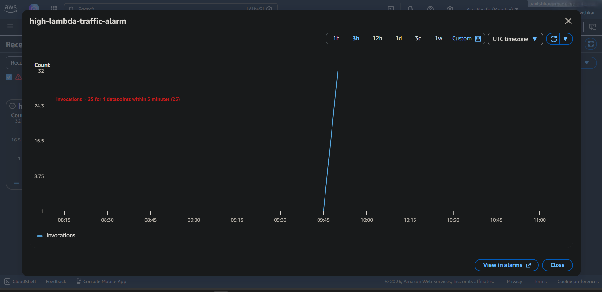
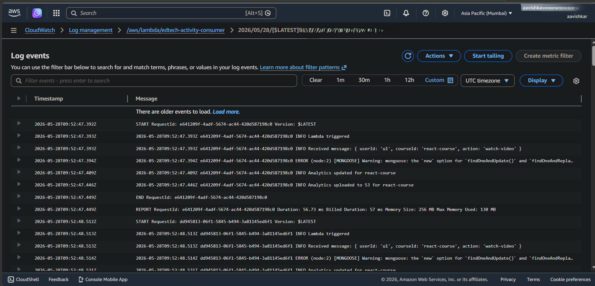

# AWS-Native Migration Documentation

# Overview

This document describes the evolution of the Event-Driven EdTech Learning Platform from a self-managed asynchronous processing architecture to an AWS-native serverless event-processing architecture.

The migration was implemented to demonstrate how event-driven systems can evolve from self-managed worker infrastructure toward managed cloud-native services while preserving asynchronous processing capabilities.

---

# Business Context

The platform generates analytics events from learner activities such as:

- Course enrollments
- Video consumption
- Learning progress updates
- Course completions
- Ratings and reviews

These events are processed asynchronously to avoid impacting user-facing application performance.

---

# Initial Architecture

## Self-Managed Event Processing

Version 1 used BullMQ, Redis, and dedicated worker services for asynchronous event processing.

```text
Backend API
    ↓
BullMQ Queue
    ↓
Redis
    ↓
Worker Service
    ↓
MongoDB Analytics
```

---

# Self-Managed Architecture Diagram


---

## Responsibilities

The worker service handled:

- Analytics aggregation
- Background processing
- Retry handling
- Event execution
- Queue consumption

Redis acted as the queue backend for BullMQ.

---

# Migration Goals

The migration was implemented to demonstrate:

- Cloud-native event processing
- Managed queue infrastructure
- Serverless execution
- Reduced operational complexity
- Event-driven scalability
- Managed observability

---

# Migrated Architecture

## AWS-Native Event Processing

Version 2 replaces self-managed queue infrastructure with AWS-managed services.

```text
Backend API
    ↓
Amazon SQS
    ↓
AWS Lambda
    ↓
MongoDB Analytics
    ↓
Amazon S3 Reports
```

---

# AWS-Native Architecture Diagram


---

# Amazon SQS Integration

Amazon SQS is used as the event transport layer between application services and asynchronous consumers.

Features implemented:

- Queue-based event delivery
- Decoupled event processing
- Managed queue infrastructure
- Lambda trigger integration
- Reliable asynchronous processing



---

# AWS Lambda Processing

AWS Lambda replaces the dedicated worker service.

Lambda functions automatically consume queued events and process analytics workloads without requiring dedicated infrastructure management.

Responsibilities include:

- Analytics event processing
- Aggregation workflows
- MongoDB updates
- S3 report generation
- Failure handling

---

# S3 Analytics Storage

Processed analytics reports are uploaded into Amazon S3 for durable cloud storage and future reporting workflows.

The uploaded JSON reports demonstrate asynchronous analytics aggregation handled through AWS Lambda event processing.



---

# Key Architectural Changes

## Removed

- Redis container
- Worker container
- Self-managed polling mechanisms
- Dedicated worker infrastructure
- Queue infrastructure maintenance

---

## Added

- Amazon SQS
- AWS Lambda
- Amazon S3 analytics storage
- CloudWatch logging
- CloudWatch alarms
- SNS notifications
- IAM-based access control

---

# Benefits of AWS-Native Architecture

The migrated architecture provides:

- Fully managed queue service
- Auto-scaling event consumers
- Event-triggered execution
- Reduced operational overhead
- Improved reliability
- Native AWS observability
- Simplified infrastructure management

---

# Monitoring and Observability

Implemented monitoring capabilities include:

- CloudWatch Logs
- Lambda execution logging
- SQS event visibility monitoring
- Application health checks
- Event-processing visibility

---

# CloudWatch Alarm Monitoring

CloudWatch alarms were configured to monitor Lambda invocation traffic thresholds.

When Lambda invocations exceed configured thresholds, Amazon SNS automatically sends operational alert notifications.

Implemented monitoring capabilities include:

- Lambda invocation monitoring
- CloudWatch metric alarms
- SNS email notifications
- Traffic threshold alerting
- Serverless operational visibility



---

# Lambda Event Processing Logs

CloudWatch Logs provide centralized visibility into asynchronous event-processing workflows.

The logs below demonstrate:

- SQS event consumption
- Lambda execution
- MongoDB analytics updates
- S3 analytics uploads



---

# Branch Strategy

## Main Branch

Implements:

- BullMQ
- Redis
- Worker service
- Self-managed event processing

---

## sqs-lambda-migration Branch

Implements:

- Amazon SQS
- AWS Lambda
- Cloud-native event processing
- Serverless execution workflows

---

# Migration Summary

The migration demonstrates how an event-driven application can evolve from self-managed asynchronous infrastructure to managed cloud-native services.

Both architectures achieve asynchronous event processing, but the AWS-native implementation reduces operational responsibilities while improving scalability, observability, and infrastructure simplicity.

---

# Future Improvements

Potential future enhancements:

- Dead Letter Queue (DLQ) integration
- EventBridge integration
- Blue-green deployments
- Canary deployments
- Centralized log aggregation
- Distributed tracing
- ECS/Fargate migration
